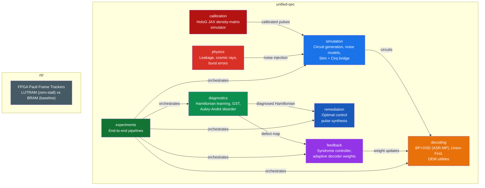

# unified-qec

A research-grade quantum error correction toolkit consolidating simulation, decoding, diagnostics, feedback control, hardware physics modeling, pulse remediation, and differentiable calibration into one cohesive package.

[](https://www.python.org/downloads/)
[](LICENSE)

## Architecture



The core pipeline: **Diagnose → Control → Remediate → Validate**

## Installation

```bash
# Core (Stim + PyMatching)
pip install -e .

# With specific extras
pip install -e ".[jax]"       # HoloG calibration
pip install -e ".[cirq]"      # Stim-Cirq coherent bridge
pip install -e ".[bposd]"     # BP+OSD decoder
pip install -e ".[gst]"       # Gate Set Tomography

# Everything
pip install -e ".[all]"
```

## Quick Start

### Diagnose hardware defects

```python
from unified_qec.diagnostics import HamiltonianLearner, AubryAndreModel
import numpy as np

learner = HamiltonianLearner(system_size=6)
h_fields = AubryAndreModel.generate_fields(6)

# Simulate experimental data from defective hardware
J_true = np.array([1.0, 1.0, 0.3, 1.0, 1.0])  # defect at bond 2
t_points = np.linspace(0.1, 5.0, 30)
data = learner.simulate_dynamics(J_true, h_fields, t_points)

# Recover Hamiltonian and detect defects
J_recovered, error = learner.learn_hamiltonian(data, t_points, h_fields)
defects = learner.detect_defects(J_recovered)
print(defects["weak_couplings"])  # → [2]
```

### Deploy feedback control

```python
from unified_qec.feedback import SyndromeFeedbackController, AdaptiveDecoderWeights

controller = SyndromeFeedbackController(Ki=0.05, feedback_latency=3)
weights = AdaptiveDecoderWeights(base_error_rate=0.001)

controller.setpoint = 0.1
correction = controller.update(measured_density=0.12)
effective_p = weights.compute_weights(correction)
```

### Synthesize corrective pulses

```python
from unified_qec.remediation import PulseSynthesizer

synth = PulseSynthesizer(system_size=6, gate_time=8.0)
pulse, fidelity = synth.synthesize(J_recovered, h_fields)
print(f"Recovered fidelity: {fidelity*100:.1f}%")
```

### Differentiable calibration (requires JAX)

```python
from unified_qec.calibration.calibrate import calibrate_plaquette

optimal_params, error_history = calibrate_plaquette(
    n_data=6, num_steps=200, t1_us=30.0, zz_strength=0.02
)
```

### Run the full pipeline

```python
from unified_qec.experiments.full_pipeline import run_full_pipeline

results = run_full_pipeline(code_distance=5, verbose=True)
```

## Package Layout

```
src/unified_qec/
├── simulation/        Surface code circuits, Stim-Cirq bridge, noise models
├── decoding/          BP+OSD (ASR-MP), Union-Find, DEM utilities
├── diagnostics/       Hamiltonian learning, Aubry-André, GST, SPAM
├── feedback/          Syndrome controller, adaptive weights, frequency analysis
├── physics/           Leakage, cosmic rays, burst errors
├── remediation/       Optimal control pulse synthesis
├── calibration/       HoloG JAX density-matrix simulator
└── experiments/       End-to-end pipeline demonstrations

rtl/src/               FPGA Pauli frame trackers (SystemVerilog)
rtl/sim/               BRAM-vs-LUTRAM benchmark harness
```

## Optional Dependencies

| Extra | Enables | Library |
|---|---|---|
| `[cirq]` | Coherent noise simulation | cirq-core, stimcirq |
| `[jax]` | Differentiable calibration | jax, jaxlib |
| `[gst]` | Gate Set Tomography | pyGSTi |
| `[bposd]` | BP+OSD decoder | ldpc, sinter |
| `[uf]` | Union-Find decoder | fusion-blossom, sinter |
| `[dev]` | Testing & linting | pytest, ruff, mypy |

## Testing

```bash
pip install -e ".[dev]"
pytest tests/ -v
```

## License

MIT
