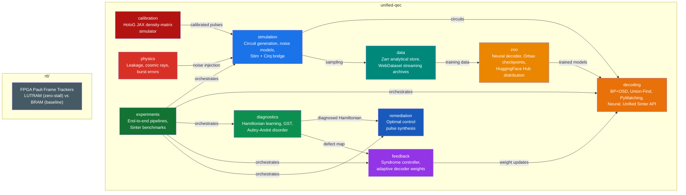

# unified-qec

A research-grade quantum error correction toolkit that consolidates simulation, decoding, diagnostics, feedback control, hardware physics modeling, pulse remediation, differentiable calibration, neural decoding, versioned model distribution, cloud-native data storage, and FPGA control logic into one cohesive Python + SystemVerilog package.

[](https://www.python.org/downloads/)
[](LICENSE)
[](https://github.com/justinarndt/unified-qec/actions)

## Why unified-qec?

Most QEC research treats each stage of the error correction stack — circuit generation, decoding, noise characterization, feedback control — as an isolated concern. **unified-qec** connects them into a single closed-loop framework where:

- Diagnosed hardware defects inform corrective pulse synthesis
- Decoded syndrome density drives real-time feedback control
- Adaptive decoder weights track non-stationary noise drift
- Leakage, cosmic rays, and burst errors feed back into the simulation loop
- FPGA Pauli frame trackers validate sub-microsecond control latency

The core pipeline: **Diagnose → Control → Remediate → Validate**

## Architecture



---

## Module Reference

### `simulation/` — Circuit Generation & Noise Models

Stim-based surface code circuit generation with physically realistic noise channels.

| Class / Function | Description |
|---|---|
| `SurfaceCodeCircuit` | Rotated surface code generator with configurable distance, rounds, and noise. Wraps `stim.Circuit.generated()` with batch decoding via PyMatching. |
| `DriftingNoiseModel` | Non-stationary noise via Ornstein-Uhlenbeck process: `dp = θ(μ − p)dt + σ dW`. Models per-qubit local drift and global T1/T2 fluctuations. |
| `NoiseParameters` | Dataclass for gate/measurement/reset error rates with `scale()` support. |
| `CoherentNoiseModel` | Extended noise model with coherent over-rotation, ZZ crosstalk, T1/T2 decay, and leakage/seepage rates. Used by the Stim↔Cirq bridge. |
| `SPAMNoiseModel` | State preparation and measurement noise: readout bias, prep error, asymmetric bit-flip channels. |
| `StimCirqBridge` | Converts between Stim and Cirq representations for hybrid simulation — Stim for speed, Cirq for coherent noise fidelity. Includes DEM extraction, adaptive weight updates, and coherent noise injection. |
| `CoherentNoiseInjector` | Injects gate over-rotations (`Rz(ε)`), ZZ crosstalk, and amplitude damping into Cirq circuits. |
| `generate_stress_circuit()` | Stress-test circuit with sinusoidal drift and burst noise injection. |
| `generate_leakage_circuit()` | Circuit with heralded leakage noise (persistent bit-flip approximation). |
| `generate_standard_circuit()` | Uniform depolarizing noise for baseline benchmarks. |

---

### `decoding/` — Syndrome Decoding

Four decoder backends with a unified [sinter](https://github.com/quantumlib/Stim/tree/main/glue/sinter) API for Monte Carlo threshold estimation.

| Class / Function | Description |
|---|---|
| `UnifiedQECDecoder` | **Section 7 unified decoder factory.** Pickle-safe `sinter.Decoder` that routes to any of 4 backends (`bposd`, `uf`, `pymatching`, `neural`) via a single interface. Drop-in replacement for `sinter.collect(decoder=...)`. |
| `ASRMPDecoder` | **Primary decoder.** Belief Propagation + Ordered Statistics Decoding (BP+OSD) via the `ldpc` library. Configurable BP method (`product_sum` / `min_sum`), OSD order, and max iterations. Converts DEM→sparse matrices automatically. |
| `TesseractBPOSD` | Sinter-compatible decoder factory implementing the `sinter.Decoder` interface for parallelized Monte Carlo sampling. |
| `TesseractCompiledDecoder` | Compiled decoder implementing `sinter.CompiledDecoder` with bit-packed shot decoding. |
| `UnionFindDecoder` | Baseline Union-Find / local clustering decoder with O(n·α(n)) per-shot complexity via `fusion-blossom`. Sinter-integrated. |
| `dem_to_matrices()` | Converts `stim.DetectorErrorModel` → sparse parity check matrix **H**, logical observable matrix **L**, and prior vector **p**. |
| `get_channel_llrs()` | Computes log-likelihood ratios `log((1−p)/p)` from prior error probabilities for message-passing initialization. |

---

### `diagnostics/` — Hardware Characterization

Inverse-problem solvers that reconstruct hardware parameters from experimental observables.

| Class / Function | Description |
|---|---|
| `HamiltonianLearner` | Reconstructs coupling parameters of a spin-chain Hamiltonian from time-domain imbalance traces via gradient-based optimization (`L-BFGS-B`). Detects defective couplings by threshold analysis of recovered J values. Includes GST cross-validation. |
| `AubryAndreModel` | Generates quasi-periodic disorder fields `h_i = Δ cos(2πβi)` (β = golden ratio) for Many-Body Localization. Default Δ = 6.0 places the system deep in the MBL phase (critical Δ/J ≈ 3.5). |
| `GSTBenchmark` | Gate Set Tomography via pyGSTi — generates circuits, simulates data, runs GST protocol. Provides per-gate process fidelities as a gold-standard reference. |
| `SPAMNoiseModel` | SPAM noise injection and sweep generation for robustness testing. |

---

### `feedback/` — Real-Time Control

Closed-loop control that tracks hardware drift and adjusts decoder weights in real time.

| Class / Function | Description |
|---|---|
| `SyndromeFeedbackController` | Integral controller tracking syndrome density drift. Estimates `δ(t) = ρ(t) − ρ_ss` and feeds corrections to the decoder. Models realistic feedback latency via a bounded correction queue and T1/T2 decay penalty during the processing window. |
| `AdaptiveDecoderWeights` | Converts drift estimates to effective error rates for MWPM edge weight recalculation: `p_eff = p_base + δ`. Includes LLR conversion `w = log((1−p)/p)`. |

> **Hardware tie-in**: The `latency_ns` parameter directly corresponds to the FPGA update latency measured in the RTL benchmark. The LUTRAM tracker achieves <10 ns per update — fast enough that the feedback decay penalty is negligible. See `rtl/sim/benchmark_harness.sv`.

---

### `physics/` — Hardware Noise Modeling

Beyond-Pauli noise sources that create the "reality gap" between simulation and hardware.

| Class / Function | Description |
|---|---|
| `LeakageTracker` | Tracks per-qubit leakage to the |2⟩ (f) state in transmon hardware. Models gate-induced leakage, seepage (LRU recovery), and estimates the additional logical error rate from leaked qubits. Maintains per-cycle history for analysis. |
| `CosmicRaySimulator` | Simulates high-energy cosmic ray impacts as localized depolarization bursts with exponential falloff from the impact center. Configurable impact rate, radius, and maximum depolarization. |
| `BurstErrorDetector` | Real-time detection of burst errors via syndrome density spike monitoring and spatial clustering. When a burst is detected, recommends expanding the Cirq simulation region for proper correlated-error modeling. |

---

### `remediation/` — Corrective Pulse Synthesis

Physics-aware optimal control that navigates around diagnosed defects.

| Class / Function | Description |
|---|---|
| `PulseSynthesizer` | Given a diagnosed Hamiltonian `H_drift + H_defect`, synthesizes time-dependent Z-control fields `u_i(t)` that maximize state transfer fidelity: `F = |⟨ψ_target|U(T)|ψ_init⟩|²`. Uses L-BFGS-B with smoothness and power regularization. Sparse operator caching for efficiency on 2^L-dimensional Hilbert spaces. |

---

### `calibration/` — Differentiable Calibration (HoloG)

JAX-based density-matrix simulator for gradient-descent calibration of plaquette control pulses.

| Class / Function | Description |
|---|---|
| `calibrate_plaquette()` | Optimizes Rx rotation angles via JAX autodiff to minimize syndrome error probability. Models T1 decay, ZZ crosstalk, and measurement noise in the cost function. |
| `simulate_plaquette()` | Density-matrix simulation of a plaquette stabilizer with configurable decoherence and crosstalk. Forward model for the calibration loop. |
| `run_benchmark()` | End-to-end benchmark comparing initial (π-pulse) vs. optimized parameters. |

---

### `zoo/` — Model Zoo (Section 7)

Versioned model artifacts: neural decoders, Orbax checkpointing, and HuggingFace Hub distribution.

| Class / Function | Description |
|---|---|
| `NeuralSyndromeDecoder` | Transformer-based neural syndrome decoder (JAX/Flax). 4-layer, 8-head, 256-dim architecture with residual connections, layer norm, and GELU activations. Includes `predict()` with JIT-compiled inference. |
| `create_train_state()` | Initializes a Flax `TrainState` with AdamW optimizer for neural decoder training. |
| `train_step()` | Single gradient step with sigmoid binary cross-entropy loss. |
| `generate_training_data()` | Samples syndrome/observable pairs from a Stim circuit for neural decoder training. |
| `ModelCheckpoint` | Orbax-based checkpoint manager with composite saves (model PyTree + JSON metadata), retention policies, metadata-only restore, and `best_step()` metric search. |
| `NumpyCheckpoint` | Lightweight `.npz`-based checkpoint manager for non-JAX users. Retention policies and JSON metadata sidecars. |
| `ZooManager` | HuggingFace Hub integration: `push()`, `pull()`, `pull_snapshot()`, `list_revisions()`, and auto-generated Model Cards with YAML frontmatter. |

---

### `data/` — Open Data (Section 7)

Cloud-native storage for QEC syndrome datasets.

| Class / Function | Description |
|---|---|
| `ZarrStore` | Chunked, compressed Zarr arrays for syndrome data. Blosc/Zlib codecs, append support, selective slice reading, failure event filtering, and JSON metadata. Works with local paths or cloud URIs via fsspec. |
| `WebDatasetWriter` | Writes syndrome data as sharded POSIX tar archives (`.syndrome.npy` + `.observable.npy` + `.json` per sample). Manifest output for reproducibility. |
| `WebDatasetReader` | Streaming reader with in-memory shuffle buffer. Compatible with JAX/PyTorch data loaders. |
| `SinterToData` | Bridges Sinter/Stim sampling output to Zarr and WebDataset formats. Batched I/O, auto-metadata extraction, and support for pre-sampled detection events. |

---

### `experiments/` — End-to-End Pipelines

Orchestration layer that connects all modules into complete workflows.

| Function | Description |
|---|---|
| `run_full_pipeline()` | Executes the complete **Diagnose → Control → Remediate → Validate** workflow: (1) Hamiltonian learning detects coupling defects, (2) syndrome feedback controller tracks drift, (3) pulse synthesizer generates corrective fields, (4) leakage tracker validates residual error. |
| `benchmark_sinter` | CLI harness for Sinter Monte Carlo benchmarks across `(d, p)` grids. Outputs CSV results and threshold curve plots. Usage: `python -m unified_qec.experiments.benchmark_sinter --distances 3 5 7`. |

---

### `rtl/` — FPGA Pauli Frame Tracking (SystemVerilog)

Hardware implementation of the real-time Pauli frame update logic, benchmarking two memory strategies on Xilinx UltraScale+.

| Module | Memory | Read Latency | Throughput |
|---|---|---|---|
| `apex_lutram_tracker` | Distributed LUTRAM | 0 cycles (async) | 100% — no stalls |
| `baseline_bram_tracker` | Block RAM | 1 cycle (sync) | ~50% — pipeline stalls |
| `benchmark_harness` | — | — | Rapid-fire + RAW latency testbench |

Both modules use `{Z, X}` 2-bit Pauli frame encoding, proper `rst_n` reset, `$clog2` address sizing, and explicit `(* ram_style *)` synthesis attributes. See [`rtl/README.md`](rtl/README.md) for simulation instructions (Vivado + Icarus Verilog).

---

## Installation

```bash
# Core (Stim + PyMatching)
pip install -e .

# With specific extras
pip install -e ".[jax]"       # Differentiable calibration + neural decoder (JAX, Flax, Optax)
pip install -e ".[cirq]"      # Stim-Cirq coherent noise bridge
pip install -e ".[bposd]"     # BP+OSD decoder (ldpc + sinter)
pip install -e ".[gst]"       # Gate Set Tomography (pyGSTi)
pip install -e ".[uf]"        # Union-Find decoder (fusion-blossom)
pip install -e ".[zoo]"       # Model Zoo (Orbax + HuggingFace Hub)
pip install -e ".[data]"      # Open Data (Zarr + WebDataset)

# Everything
pip install -e ".[all]"

# Development (pytest + ruff + mypy)
pip install -e ".[dev]"
```

## Quick Start

### Diagnose hardware defects

```python
from unified_qec.diagnostics import HamiltonianLearner, AubryAndreModel
import numpy as np

learner = HamiltonianLearner(system_size=6)
h_fields = AubryAndreModel.generate_fields(6)

# Simulate experimental data from defective hardware
J_true = np.array([1.0, 1.0, 0.3, 1.0, 1.0])  # defect at bond 2
t_points = np.linspace(0.1, 5.0, 30)
data = learner.simulate_dynamics(J_true, h_fields, t_points)

# Recover Hamiltonian and detect defects
J_recovered, error = learner.learn_hamiltonian(data, t_points, h_fields)
defects = learner.detect_defects(J_recovered)
print(defects["weak_couplings"])  # → [2]
```

### Deploy feedback control

```python
from unified_qec.feedback import SyndromeFeedbackController, AdaptiveDecoderWeights

controller = SyndromeFeedbackController(Ki=0.05, feedback_latency=3)
weights = AdaptiveDecoderWeights(base_error_rate=0.001)

controller.setpoint = 0.1
correction = controller.update(measured_density=0.12)
effective_p = weights.compute_weights(correction)
```

### Synthesize corrective pulses

```python
from unified_qec.remediation import PulseSynthesizer

synth = PulseSynthesizer(system_size=6, gate_time=8.0)
pulse, fidelity = synth.synthesize(J_recovered, h_fields)
print(f"Recovered fidelity: {fidelity*100:.1f}%")
```

### Simulate and decode with drifting noise

```python
from unified_qec.simulation import SurfaceCodeCircuit, DriftingNoiseModel

circuit = SurfaceCodeCircuit(distance=5, rounds=5)
drift = DriftingNoiseModel(num_qubits=25, drift_rate=0.005)

# Step the drift and generate circuits with current noise
drift.step()
params = drift.get_effective_params()
failures, density = circuit.run_batch(params, batch_size=1024)
```

### Track leakage through QEC cycles

```python
from unified_qec.physics import LeakageTracker

tracker = LeakageTracker(num_qubits=49, leakage_rate=0.001, seepage_rate=0.01)
for cycle in range(100):
    new_leaks, seepage = tracker.run_cycle()
stats = tracker.get_statistics()
print(f"Leaked: {stats['current_leaked']}/49, error contribution: {stats['error_contribution']:.4f}")
```

### Differentiable calibration (requires JAX)

```python
from unified_qec.calibration.calibrate import calibrate_plaquette

optimal_params, error_history = calibrate_plaquette(
    n_data=6, num_steps=200, t1_us=30.0, zz_strength=0.02
)
```

### Run the full pipeline

```python
from unified_qec.experiments.full_pipeline import run_full_pipeline

results = run_full_pipeline(code_distance=5, verbose=True)
```

### Run a Sinter benchmark

```python
from unified_qec.decoding import UnifiedQECDecoder
import sinter, stim

tasks = [
    sinter.Task(
        circuit=stim.Circuit.generated(
            "surface_code:rotated_memory_z", distance=d, rounds=d,
            after_clifford_depolarization=p,
        ),
        decoder=UnifiedQECDecoder(backend="pymatching"),
        json_metadata={"d": d, "p": p},
    )
    for d in [3, 5, 7] for p in [0.001, 0.005, 0.01]
]
stats = sinter.collect(tasks=tasks, num_workers=4, max_shots=10000)
```

### Save syndrome data to Zarr (requires `[data]`)

```python
from unified_qec.data import SinterToData
import stim

circuit = stim.Circuit.generated(
    "surface_code:rotated_memory_z", distance=5, rounds=5,
    after_clifford_depolarization=0.005,
)
converter = SinterToData()
result = converter.from_stim_samples(
    circuit, num_shots=100_000, output_path="./datasets/d5_p005",
    formats=["zarr", "webdataset"],
)
print(result)  # paths and shot counts
```

## Package Layout

```
src/unified_qec/
├── simulation/        Surface code circuits, Stim-Cirq bridge, noise models
│   ├── surface_code.py          SurfaceCodeCircuit, DriftingNoiseModel
│   ├── noise_models.py          CoherentNoiseModel, SPAMNoiseModel, stress circuits
│   └── stim_cirq_bridge.py      StimCirqBridge, CoherentNoiseInjector
├── decoding/          BP+OSD (ASR-MP), Union-Find, Unified Sinter API
│   ├── sinter_api.py            UnifiedQECDecoder (4-backend sinter factory)
│   ├── asr_mp.py                ASRMPDecoder, TesseractBPOSD (sinter)
│   ├── union_find.py            UnionFindDecoder (fusion-blossom)
│   └── dem_utils.py             DEM→matrix conversion, LLR computation
├── zoo/               Model Zoo — neural decoders + versioned checkpoints
│   ├── neural_decoder.py        NeuralSyndromeDecoder (Transformer, JAX/Flax)
│   ├── checkpoint.py            ModelCheckpoint (Orbax), NumpyCheckpoint
│   └── hub.py                   ZooManager (HuggingFace Hub push/pull)
├── data/              Open Data — cloud-native syndrome storage
│   ├── zarr_store.py            ZarrStore (chunked, compressed arrays)
│   ├── webdataset_writer.py     WebDatasetWriter/Reader (sharded tar)
│   └── converters.py            SinterToData (Stim → Zarr/WebDataset)
├── diagnostics/       Hamiltonian learning, Aubry-André, GST, SPAM
│   ├── hamiltonian_learner.py   HamiltonianLearner (inverse problem solver)
│   ├── aubry_andre.py           AubryAndreModel (MBL disorder generator)
│   ├── gst_benchmark.py         GSTBenchmark (pyGSTi wrapper)
│   └── spam_noise.py            SPAMNoiseModel injection utilities
├── feedback/          Syndrome controller, adaptive weights
│   ├── controller.py            SyndromeFeedbackController (integral + decay)
│   └── decoder_weights.py       AdaptiveDecoderWeights (MWPM LLR)
├── physics/           Leakage, cosmic rays, burst errors
│   ├── leakage.py               LeakageTracker (|2⟩ state tracking)
│   ├── cosmic_ray.py            CosmicRaySimulator (localized depolarization)
│   └── burst_error.py           BurstErrorDetector (spatial clustering)
├── remediation/       Optimal control pulse synthesis
│   └── pulse_synthesis.py       PulseSynthesizer (L-BFGS-B + regularization)
├── calibration/       HoloG JAX density-matrix simulator
│   ├── calibrate.py             calibrate_plaquette() (JAX autodiff)
│   ├── simulator.py             simulate_plaquette() (density matrix)
│   ├── config.py                Physical constants, Pauli operators
│   ├── physics.py               Crosstalk and decoherence channels
│   └── circuit.py               Gate embedding utilities
└── experiments/       End-to-end pipelines + Sinter benchmarks
    ├── full_pipeline.py         Diagnose → Control → Remediate → Validate
    └── benchmark_sinter.py      CLI Monte Carlo benchmark harness

rtl/
├── src/
│   ├── apex_lutram_tracker.sv     Zero-stall LUTRAM Pauli frame tracker
│   └── baseline_bram_tracker.sv   BRAM baseline with pipeline stalls
└── sim/
    └── benchmark_harness.sv       Rapid-fire + RAW latency testbench
```

## Optional Dependencies

| Extra | Enables | Library |
|---|---|---|
| `[cirq]` | Coherent noise simulation | cirq-core, stimcirq |
| `[jax]` | Differentiable calibration + neural decoder | jax, jaxlib, flax, optax |
| `[gst]` | Gate Set Tomography | pyGSTi |
| `[bposd]` | BP+OSD decoder | ldpc, sinter |
| `[uf]` | Union-Find decoder | fusion-blossom, sinter |
| `[zoo]` | Model Zoo (checkpointing + distribution) | orbax-checkpoint, huggingface-hub |
| `[data]` | Open Data (cloud-native storage) | zarr, webdataset, fsspec |
| `[dev]` | Testing & linting | pytest, ruff, mypy |

## Testing

```bash
pip install -e ".[dev]"
pytest tests/ -v

# Lint check
ruff check src/ tests/
```

## License

MIT
